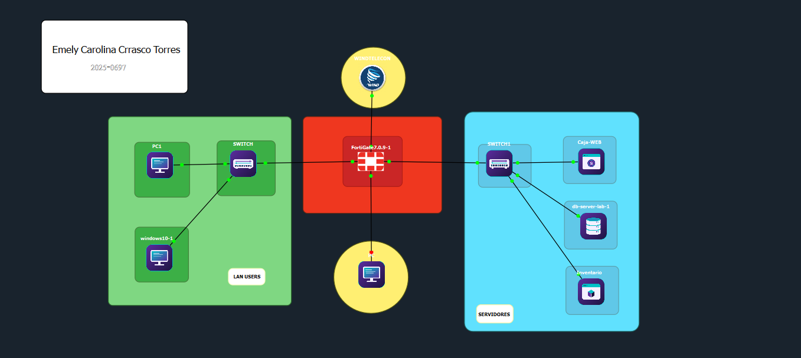

# 🔐 Laboratorio de Seguridad de Redes

> Implementación de una infraestructura segmentada con DMZ, VLAN, FortiGate y controles de seguridad.

   

**Autora:** Emely Carolina Carrasco Torres · 2025-0697

## 🎥 Video demostrativo

> ⏳ Enlace pendiente: [`video/video-demostrativo.md`]([video/video-demostrativo.md](https://youtu.be/rwTNR78lhXo))

## 📌 Propósito del laboratorio
Demostrar que una red segmentada puede aislar servidores en una **DMZ**, restringir su administración a una sola VLAN y bloquear el acceso a un sistema concreto, todo controlado por políticas de **FortiGate** (GUI) y reforzado con seguridad de capa 2 en los switches. Cada control tiene su evidencia y su prueba.

## 🏗️ Arquitectura


Más diagramas: [`diagrams/README.md`](diagrams/README.md).

## 🌐 Segmentación de red

| Segmento | VLAN | Red | Gateway | Función |
|---|--:|---|---|---|
| Usuarios | 10 | 20.25.6.0/25 | 20.25.6.1 | Usuarios (DHCP .10–.120) |
| Usuarios / Administración | 20 | 20.25.6.128/25 | 20.25.6.129 | Único segmento con SSH a servidores (DHCP .138–.248) |
| DMZ | — | 20.25.97.0/28 | 20.25.97.1 | Servidores |
| WAN | — | 192.168.42.0/24 | — | Salida a Internet (port1: .138) |

## 🖥️ Dispositivos

| Dispositivo | Función | IP | Segmento |
|---|---|---|---|
| FortiGate | Firewall / DHCP / gateway | 192.168.42.138 (WAN), 20.25.6.1, 20.25.6.129, 20.25.97.1 | Todos |
| SWITCH-USERS | Switching + troncal 802.1Q | sin IP de gestión | VLAN 10 / 20 |
| SW-DMZ-0697 | Switching de servidores | sin IP de gestión | DMZ |
| Caja-WEB | Web — Sistema de Caja | 20.25.97.2 | DMZ |
| Inventario | Web — Sistema de Inventario | 20.25.97.3 | DMZ |
| db-server-lab-1 | Base de datos | 20.25.97.4 | DMZ |

## 🔥 Controles de seguridad
- **DMZ:** `port3` con rol DMZ; solo responde PING administrativo. → [05](docs/05-dmz.md)
- **VLAN:** dominios de broadcast separados; troncal solo 10,20. → [04](docs/04-vlan-y-segmentacion.md)
- **Firewall:** 10 políticas con log total + denegación implícita. → [07](docs/07-politicas-firewall.md)
- **DMZ → LAN:** `DENY` hacia VLAN 10 y VLAN 20.
- **DMZ → Internet:** solo `GRP_UPDATES` (Ubuntu / Alpine); el resto `DENY`.
- **SSH exclusivo de VLAN 20** hacia los servidores.
- **VLAN 10 → Inventario:** bloqueado con *Web Filter* (capa 7); solo accede a Caja.
- **DHCP** por VLAN desde el FortiGate. → [10](docs/10-dhcp.md)
- **Switches:** port-security sticky, BPDU Guard, SSH v2. → [08](docs/08-seguridad-switches.md)

## 🧪 Pruebas realizadas

| ID | Prueba | Esperado | Obtenido | Estado |
|---|---|:-:|:-:|:-:|
| T01 | VLAN 10 → Caja :80 | Permitido | Permitido | ✅ |
| T02 | VLAN 10 → Inventario HTTP | **Bloqueado** | Bloqueado (Web Filter) | ✅ |
| T03, T16, T17 | VLAN 10 → SSH a Caja, Inventario, DB | Bloqueado | Bloqueado | ✅ |
| T15 | VLAN 10 → Inventario HTTPS | Bloqueado | Bloqueado | ✅ |
| T04–T05 | VLAN 20 → SSH .2 / .3 / .4 | Permitido | Permitido | ✅ |
| T06 | VLAN 20 → webs Caja e Inventario | Permitido | Permitido | ✅ |
| T08, T18 | DMZ → VLAN 20 / VLAN 10 | Bloqueado | Bloqueado | ✅ |
| T09 | DMZ → archive.ubuntu.com | Permitido | HTTP 200 | ✅ |
| T10, T19 | DMZ → 8.8.8.8 / HTTPS a google y facebook | Bloqueado | Bloqueado | ✅ |
| T11–T14 | Troncal, VLAN, port-security, DHCP | Correcto | Correcto | ✅ |

Detalle (origen, destino, servicio, evidencia, conclusión): [11 · Pruebas de seguridad](docs/11-pruebas-de-seguridad.md).

## 📊 Matriz de comunicación

| Origen | Destino | Servicio | Permitido | Motivo |
|---|---|---|:-:|---|
| VLAN 10 | Caja | HTTP/HTTPS | ✅ | `VLAN10-CAJA` |
| VLAN 10 | Inventario | HTTP | ❌ | Web Filter `WF_BLOQUEO_INVENTARIO` |
| VLAN 10 | DMZ | SSH / otros | ❌ | `VLAN10-DMZ-DENY` |
| VLAN 20 | Servidores | SSH | ✅ | `VLAN20-SSH-DMZ` |
| VLAN 20 | Caja, Inventario | HTTP/HTTPS | ✅ | `VLAN20-WEB-DMZ` |
| DMZ | VLAN 10 / 20 | Cualquiera | ❌ | `DMZ-to-VLAN*-DENY` |
| DMZ | Endpoints de actualización | `SVC_UPDATES` | ✅ | `DMZ-to-WAN-UPDATES` |
| DMZ | Internet | Cualquiera | ❌ | `DMZ-to-WAN-DENY` |

> ⚠️ **Diferencia con el enunciado:** el bloqueo al Inventario usa *ACCEPT + Web Filter*, no un `DENY` directo. Ver [12](docs/12-resultados.md).

## 📚 Documentación

| | | |
|---|---|---|
| [01 Propósito](docs/01-proposito-y-alcance.md) | [02 Arquitectura](docs/02-arquitectura.md) | [03 Direccionamiento](docs/03-direccionamiento-ip.md) |
| [04 VLAN](docs/04-vlan-y-segmentacion.md) | [05 DMZ](docs/05-dmz.md) | [06 FortiGate](docs/06-fortigate.md) |
| [07 Políticas](docs/07-politicas-firewall.md) | [08 Switches](docs/08-seguridad-switches.md) | [09 Servidores](docs/09-servidores.md) |
| [10 DHCP](docs/10-dhcp.md) | [11 Pruebas](docs/11-pruebas-de-seguridad.md) | [12 Resultados](docs/12-resultados.md) |
| [13 Conclusiones](docs/13-conclusiones.md)  | [Evidencias](evidence/README.md) |

## 🗂️ Estructura
```text
├── docs/        documentación técnica (01–14)
├── topology/    topología real
├── diagrams/    diagramas Mermaid (.mmd) y página renderizada
├── configs/     running-config de switches (secretos ocultos) y nota del FortiGate
├── scripts/     config de servidores y comandos de prueba
├── evidence/    capturas por categoría + índice
└── video/       enlace al video
```
