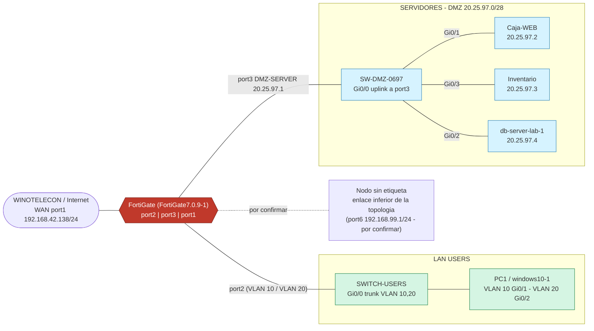
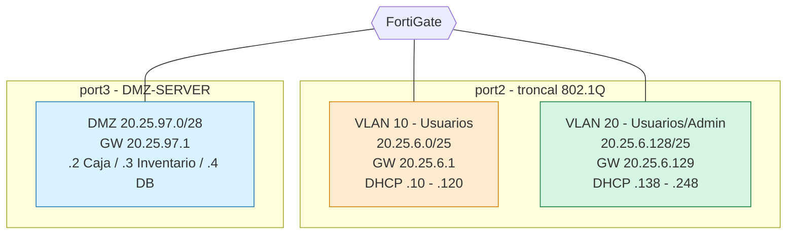
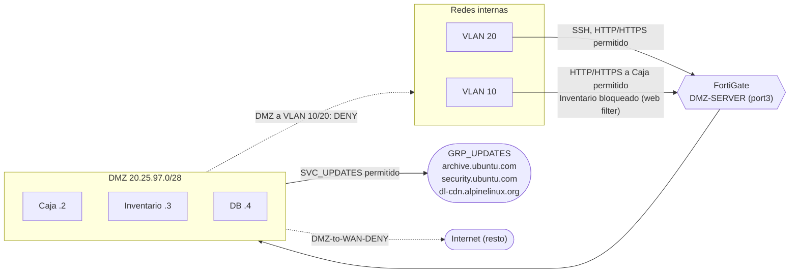
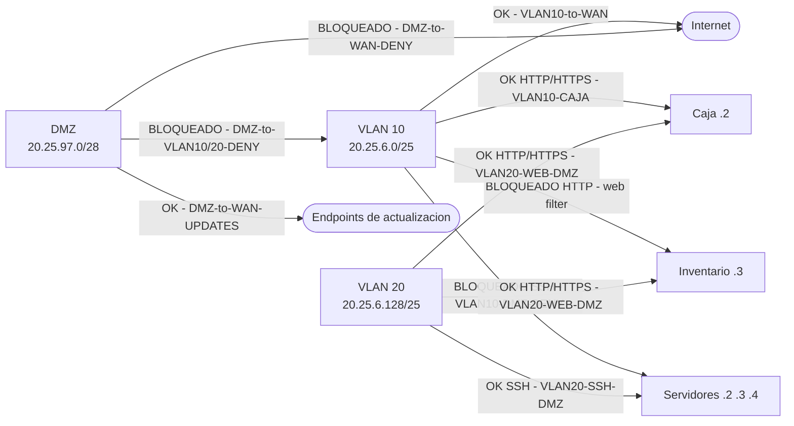
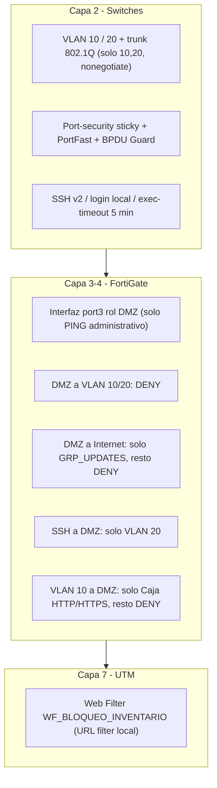

# Diagramas

Fuentes en formato Mermaid (se renderizan automáticamente en GitHub). Representan **solo** lo que aparece en las evidencias.

## Arquitectura general

## Segmentación

## DMZ

## Flujo de tráfico

## Controles de seguridad por capa

