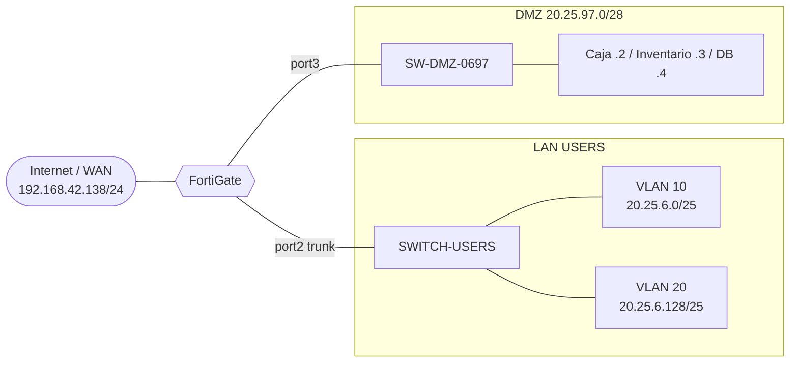

# 02 · Arquitectura

| Zona | Elementos (según la topología) |
|---|---|
| WAN | Nube `WINOTELECON` → FortiGate `port1` |
| LAN USERS | `SWITCH-USERS` (conectado a `port2`), `PC1`, `windows10-1` |
| SERVIDORES (DMZ) | `SW-DMZ-0697` (conectado a `port3`), `Caja-WEB`, `db-server-lab-1`, `Inventario` |
| Firewall | `FortiGate7.0.9-1` (nombre del nodo en GNS3) |

## Diagrama lógico

Más diagramas: [`diagrams/README.md`](../diagrams/README.md). Inconsistencias de la topología (PC2 ausente, nodo inferior sin etiqueta): ver [14](14-hallazgos-y-pendientes.md).
