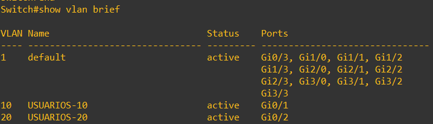
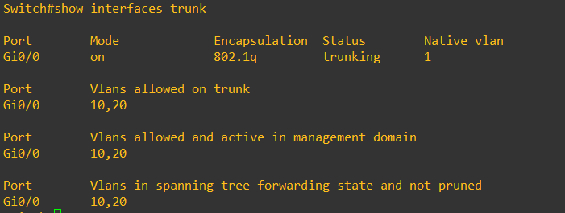

# 04 · VLAN y segmentación

## Qué se configuró
- VLAN 10 `USUARIOS-10` y VLAN 20 `USUARIOS-20` en `SWITCH-USERS`.
- Troncal 802.1Q `Gi0/0` (switch) ↔ `port2` (FortiGate) con VLAN **10,20** permitidas y `nonegotiate`.
- Subinterfaces VLAN en el FortiGate sobre `port2`, cada una con su gateway y servidor DHCP.

## Por qué
Cada VLAN es un dominio de broadcast separado: el tráfico entre VLAN **debe** pasar por el FortiGate, donde se inspecciona y se aplica política. Sin VLAN, cualquier host vería directamente a los demás en capa 2.

## Cómo funciona
`Gi0/1` (VLAN 10) y `Gi0/2` (VLAN 20) son puertos *access*; el switch etiqueta la trama con 802.1Q al subirla por el troncal. El FortiGate la recibe en la subinterfaz correspondiente y decide con sus políticas.

## Riesgo que reduce
Movimiento lateral entre departamentos y *VLAN hopping* (el troncal solo transporta 10 y 20, sin negociación DTP).

## Evidencia

| Captura | Muestra |
|---|---|
|  | VLAN 10 en `Gi0/1`, VLAN 20 en `Gi0/2` |
|  | `Gi0/0` trunking 802.1q, VLAN 10,20 |
|  | Subinterfaces VLAN en port2 |

## Resultado
Los clientes reciben direccionamiento de su VLAN ([10](10-dhcp.md)) y las políticas distinguen VLAN 10 de VLAN 20 ([07](07-politicas-firewall.md)).

> ℹ️ Las capturas de trunk/VLAN muestran el prompt `Switch#` (previo a asignar el hostname `SWITCH-USERS`). Ver [14](14-hallazgos-y-pendientes.md).
