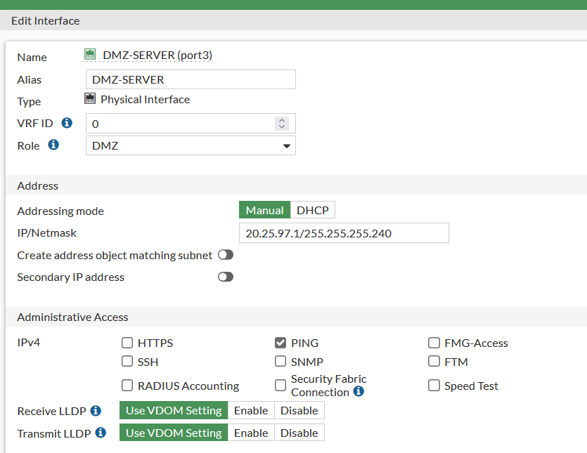
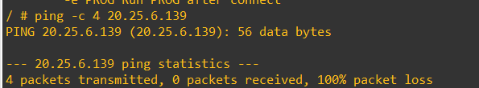
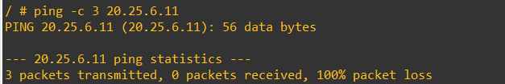
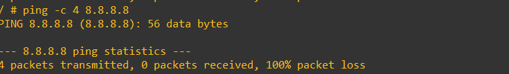
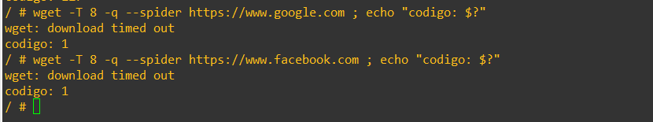
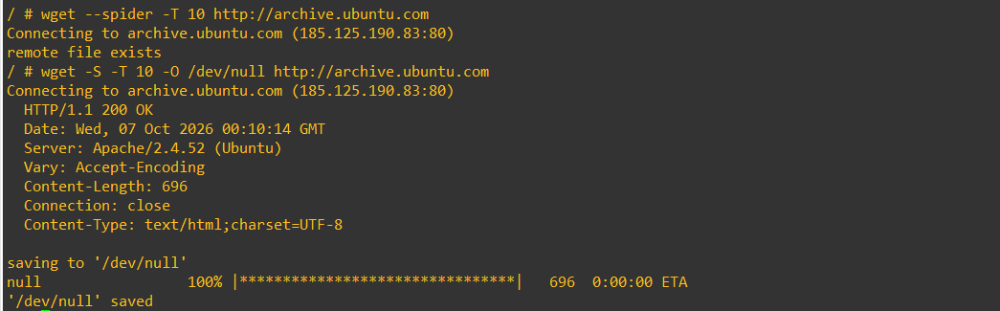

# 05 · DMZ

## Qué se configuró
`port3` del FortiGate se renombró `DMZ-SERVER`, con **rol DMZ**, IP `20.25.97.1/255.255.255.240` y como único acceso administrativo **PING**. Detrás hay `SW-DMZ-0697` con los tres servidores.

## Por qué
Los servidores exponen servicios (HTTP, SSH) y son el blanco más probable. Se aíslan para que un compromiso **no dé salto a las redes de usuarios**.

## Cómo funciona
- DMZ → VLAN 10 / VLAN 20: `DMZ-to-VLAN10-DENY` y `DMZ-to-VLAN20-DENY` (servicio ALL).
- DMZ → Internet: solo `DMZ-to-WAN-UPDATES` hacia `GRP_UPDATES`; el resto cae en `DMZ-to-WAN-DENY`.
- Desde la DMZ **no** se puede administrar el FortiGate (HTTPS/SSH desactivados en `port3`).

## Riesgo que reduce
Movimiento lateral, exfiltración y *callback* a un C2 desde un servidor comprometido (egress restringido a 3 FQDN).

## Resultado

| Prueba | Resultado | Evidencia |
|---|---|---|
| DMZ → VLAN 20 (ping a 20.25.6.139) | 100 % pérdida ✅ |  |
| DMZ → VLAN 10 (ping a 20.25.6.11) | 100 % pérdida ✅ |  |
| DMZ → 8.8.8.8 | 100 % pérdida ✅ |  |
| DMZ → google.com / facebook.com (HTTPS) | `download timed out` ✅ |  |
| DMZ → archive.ubuntu.com | HTTP 200 ✅ |  |
