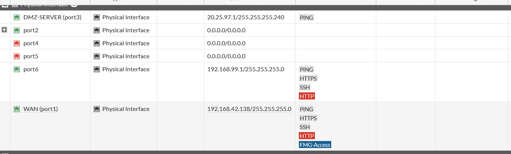
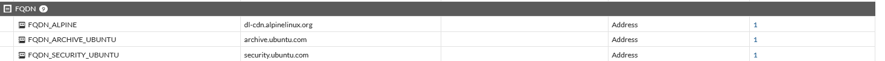
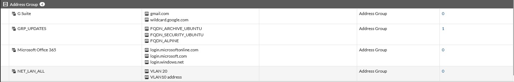
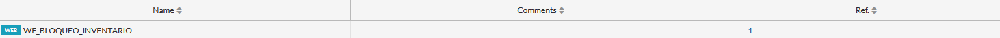

# 06 · FortiGate

Toda la configuración se hizo por **GUI**; se documenta con capturas ([`configs/fortigate/`](../configs/fortigate/README.md)).

## Interfaces

| Interfaz | Alias / Tipo | IP | Acceso administrativo visible | Estado |
|---|---|---|---|---|
| port1 | `WAN` · físico | 192.168.42.138/24 | PING, HTTPS, SSH, HTTP, FMG-Access | Up |
| port2 | físico (contiene las VLAN) | 0.0.0.0/0.0.0.0 | — | Up |
| ├ VLAN10 | `Usuarios (VLAN10)` · VLAN | 20.25.6.1/25 | PING, HTTPS, SSH (lista cortada en captura) | Up |
| └ VLAN-20 | `Usuarios (VLAN-20)` · VLAN | 20.25.6.129/25 | ninguno | Up |
| port3 | `DMZ-SERVER` · rol DMZ | 20.25.97.1/28 | PING | Up |
| port4 / port5 | físico | sin IP | — | Down |
| port6 | físico | 192.168.99.1/24 | PING, HTTPS, SSH, HTTP | Up |

## Objetos de dirección

| Objeto | Valor | Evidencia |
|---|---|---|
| `FQDN_ARCHIVE_UBUNTU` | archive.ubuntu.com |  |
| `FQDN_SECURITY_UBUNTU` | security.ubuntu.com | |
| `FQDN_ALPINE` | dl-cdn.alpinelinux.org | |
| `GRP_UPDATES` | los 3 FQDN anteriores (en 1 política) |  |
| `NET_LAN_ALL` | VLAN 20 + VLAN10 address (0 referencias) | |
| `NET-DMZ`, `SRV_CAJA`, `SRV_INVENTARIO`, `VLAN 20`, `VLAN10 address` | usados en políticas; **valores no visibles** | ver [14](14-hallazgos-y-pendientes.md) |

## Web Filter
Perfil `WF_BLOQUEO_INVENTARIO`, referenciado por 1 política → [07](07-politicas-firewall.md).

## NAT y rutas
- **NAT** por política: habilitado en `DMZ-to-WAN-UPDATES`, `VLAN20-SSH-DMZ`, `VLAN10-CAJA`, `VLAN10-INVENTARIO-BLOCK`, `VLAN10-to-WAN`; deshabilitado en `VLAN20-WEB-DMZ`.
- **Rutas estáticas:** no se aportó captura → pendiente ([14](14-hallazgos-y-pendientes.md)).
- **Logs:** todas las políticas con `Log = All` ([01-politicas](../evidence/firewall/01-politicas-firewall.png)).
