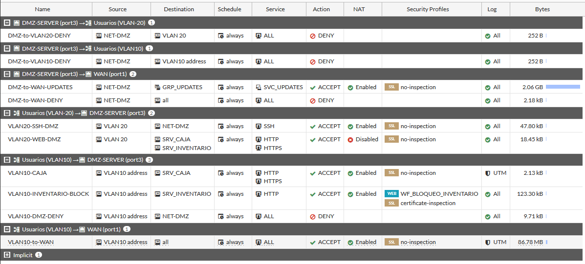

# 07 · Políticas de firewall

> Leídas directamente de la captura, en orden de evaluación. El **ID** solo es visible para dos políticas (en el log); el resto figura como `n/v`.

| ID | Nombre | Origen → Destino (interfaz) | Dirección origen → destino | Servicio | Acción | NAT | Perfiles | Bytes | Propósito |
|---|---|---|---|---|---|---|---|---|---|
| n/v | `DMZ-to-VLAN20-DENY` | DMZ-SERVER → VLAN-20 | NET-DMZ → VLAN 20 | ALL | ❌ DENY | — | — | 252 B | Impedir DMZ → VLAN 20 |
| n/v | `DMZ-to-VLAN10-DENY` | DMZ-SERVER → VLAN10 | NET-DMZ → VLAN10 address | ALL | ❌ DENY | — | — | 252 B | Impedir DMZ → VLAN 10 |
| n/v | `DMZ-to-WAN-UPDATES` | DMZ-SERVER → WAN | NET-DMZ → GRP_UPDATES | SVC_UPDATES | ✅ ACCEPT | ✅ | ssl no-inspection | 2.06 GB | Solo actualizaciones |
| n/v | `DMZ-to-WAN-DENY` | DMZ-SERVER → WAN | NET-DMZ → all | ALL | ❌ DENY | — | — | 2.18 kB | Cerrar el resto de Internet |
| **5** | `VLAN20-SSH-DMZ` | VLAN-20 → DMZ-SERVER | VLAN 20 → NET-DMZ | SSH | ✅ ACCEPT | ✅ | ssl no-inspection | 47.80 kB | Administración SSH |
| **6** | `VLAN20-WEB-DMZ` | VLAN-20 → DMZ-SERVER | VLAN 20 → SRV_CAJA, SRV_INVENTARIO | HTTP, HTTPS | ✅ ACCEPT | ❌ | ssl no-inspection | 18.45 kB | Acceso web a ambos sistemas |
| n/v | `VLAN10-CAJA` | VLAN10 → DMZ-SERVER | VLAN10 address → SRV_CAJA | HTTP, HTTPS | ✅ ACCEPT | ✅ | ssl no-inspection · UTM | 2.13 kB | VLAN 10 solo usa Caja |
| n/v | `VLAN10-INVENTARIO-BLOCK` | VLAN10 → DMZ-SERVER | VLAN10 address → SRV_INVENTARIO | HTTP | ✅ ACCEPT + **Web Filter** | ✅ | `WF_BLOQUEO_INVENTARIO` · certificate-inspection | 123.30 kB | Bloqueo L7 al Inventario |
| n/v | `VLAN10-DMZ-DENY` | VLAN10 → DMZ-SERVER | VLAN10 address → NET-DMZ | ALL | ❌ DENY | — | — | 9.71 kB | Cierre del resto de DMZ (incl. SSH) |
| n/v | `VLAN10-to-WAN` | VLAN10 → WAN | VLAN10 address → all | ALL | ✅ ACCEPT | ✅ | ssl no-inspection · UTM | 86.78 MB | Internet para VLAN 10 |
| — | Implicit deny | cualquier otro | — | — | ❌ | — | — | — | Denegación por defecto |

## Cómo se combinan

**VLAN 10 → Inventario.** La política `VLAN10-INVENTARIO-BLOCK` *acepta* el flujo para que el firewall pueda ver la URL; el **perfil Web Filter** es quien la bloquea (*Local URLfilter Block*). Por eso el log muestra la conexión con `358 B enviados / 0 B recibidos`: el handshake TCP llega, la petición HTTP se corta. Solo cubre **HTTP (80)**; cualquier otro puerto hacia el Inventario (HTTPS, SSH) cae en `VLAN10-DMZ-DENY` — comprobado en T15–T17.

**VLAN 10 → SSH.** No existe política que lo permita; `VLAN10-DMZ-DENY` lo bloquea.

**VLAN 20 → SSH/web.** Solo VLAN 20 tiene `SSH` hacia `NET-DMZ`.

**DMZ → Internet.** Primero la lista blanca (`GRP_UPDATES`), luego `DENY all`. El orden importa.

## Riesgos que reducen
| Política | Riesgo |
|---|---|
| DMZ-to-VLAN*-DENY | Movimiento lateral desde un servidor comprometido |
| DMZ-to-WAN-DENY / UPDATES | Exfiltración, C2, descarga de herramientas |
| VLAN20-SSH-DMZ | Administración desde segmento no autorizado |
| VLAN10-INVENTARIO-BLOCK | Acceso de usuarios al sistema de existencias |

Observaciones de endurecimiento sobre estas políticas: [14](14-hallazgos-y-pendientes.md).
