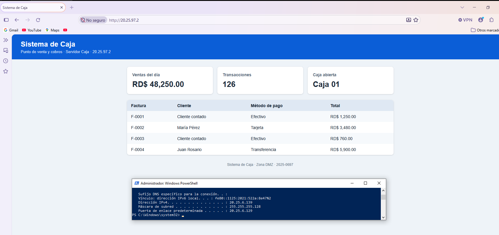
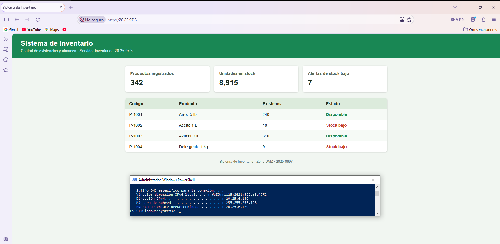

# 09 · Servidores

Los tres servidores están en la DMZ `20.25.97.0/28`, gateway `20.25.97.1`. IP configurada con los comandos de [`scripts/configurar-ip-servidores.txt`](../scripts/configurar-ip-servidores.txt) y verificada con `ip a`.

| | Caja-WEB | Inventario | db-server-lab-1 |
|---|---|---|---|
| **Función** | Web — Sistema de Caja | Web — Sistema de Inventario | Base de datos |
| **IP / máscara** | 20.25.97.2 / 255.255.255.240 | 20.25.97.3 / 255.255.255.240 | 20.25.97.4 / 255.255.255.240 |
| **Gateway** | 20.25.97.1 | 20.25.97.1 | 20.25.97.1 |
| **Segmento** | DMZ (port3) | DMZ (port3) | DMZ (port3) |
| **Puerto en switch** | Gi0/1 | Gi0/3 | Gi0/2 |
| **MAC** | 02:42:41:f2:b6:00 | 02:42:62:e7:6d:00 | 02:42:ea:f2:8c:00 |
| **Puertos TCP en escucha** | 22, 80 | 22, 80 | **solo 22** |
| **Evidencia IP** | [`ip a`](../evidence/servidores/caja-ip-a.png) | [`ip a`](../evidence/servidores/inventario-ip-a.png) | [`ip a`](../evidence/servidores/db-ip-a.png) |
| **Evidencia puertos** | [`ss -tln`](../evidence/servidores/caja-puertos-escucha.png) | [`ss -tln`](../evidence/servidores/inventario-puertos-escucha.png) | [`ss -tln`](../evidence/servidores/db-puertos-escucha.png) |

## Páginas web
| Caja (`http://20.25.97.2`) | Inventario (`http://20.25.97.3`) |
|---|---|
|  |  |

## Restricciones aplicadas
- **SSH (22):** solo desde VLAN 20 (`VLAN20-SSH-DMZ`).
- **HTTP (80):** Caja desde VLAN 10 y VLAN 20; Inventario **solo** desde VLAN 20.
- **DB:** no expone web; no existe política que permita acceso de usuarios a su servicio de base de datos (solo SSH desde VLAN 20).
- **Salida:** únicamente `GRP_UPDATES`.
- **Switch:** MAC fija por puerto (port-security sticky).

