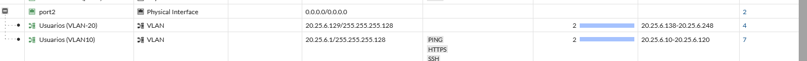
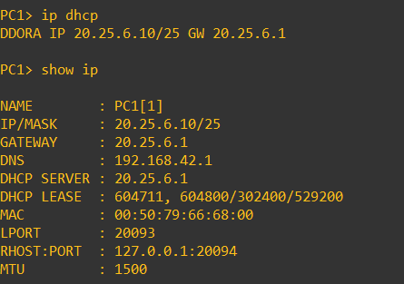
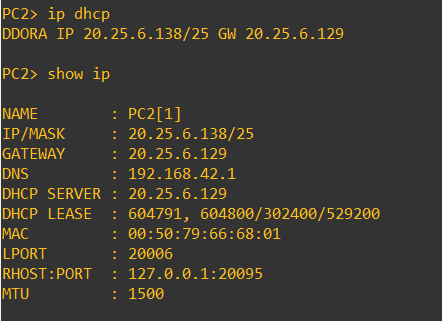

# 10 · DHCP

## Qué se configuró
El **FortiGate** actúa como servidor DHCP en cada subinterfaz VLAN (el `DHCP SERVER` entregado es la IP del gateway).

| VLAN | Servidor/Gateway | Rango visible | DNS entregado | Lease |
|---|---|---|---|---|
| 10 | 20.25.6.1 | 20.25.6.10 – 20.25.6.120 | 192.168.42.1 | 604 800 s (7 días) |
| 20 | 20.25.6.129 | 20.25.6.138 – 20.25.6.248 | 192.168.42.1 | 604 800 s (7 días) |

## Pruebas
| Cliente | Resultado | Evidencia |
|---|---|---|
| PC1 (VLAN 10) | DORA → `20.25.6.10/25`, GW `20.25.6.1` |  |
| PC2 (VLAN 20) | DORA → `20.25.6.138/25`, GW `20.25.6.129` |  |
| Windows 10 | `.11` en VLAN 10 y `.139` en VLAN 20 | [VLAN 10](../evidence/ssh/vlan10-ssh-caja-bloqueado.png) · [VLAN 20](../evidence/ssh/vlan20-tcp22-tres-servidores.png) |

## Por qué / riesgo
Direccionamiento controlado y predecible por segmento (los rangos dejan fuera `.2–.9` y `.121–.126` para reservas). Reduce errores de configuración manual. **No hay DHCP Snooping** que impida un servidor DHCP falso ([08](08-seguridad-switches.md)).
